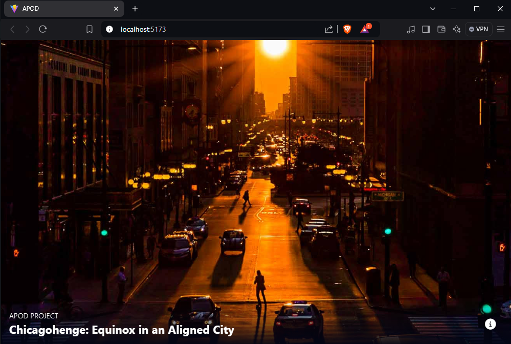

# Nasa react app

---

This website that I made using this tutorial (<a href="https://www.youtube.com/watch?v=82PXenL4MGg&t=3062s">link</a>).

## Deployment

```sh {"id":"01J8AN4G7K1Z7MFETDFY7BDQWM"}
# Set up local environment
fnm env --use-on-cd --shell power-shell | Out-String | Invoke-Expression

# Set the Node.js version
fnm use --install-if-missing 20

#This will deploy website on localhost
npm run dev
```

## Screenshot

This how the website looks like.


